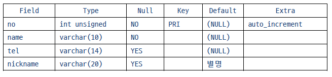

# MySQL


## Database

- 데이터를 저장할 공간


### Database 생성

```sql
CREATE DATABASE study_db default CHARACTER SET UTF8;
```


### Database 사용자 생성 및 권한 부여

- Database를 생성한뒤 이 database를 사용할 사용자를 지정하고, 권한을 설정해주어야 한다.

```sql
# mcuser = user_id
# 사용자 생성 id, pwd
create user 'mcuser'@'%' identified with mysql_native_password by '***';
# 사용자에게 권한 부여
grant all privileges on mcdb.* to 'mcuser'@'%' with grant option;

# 사용자 패스워드 변경시
alter user mcuser identified with mysql_native_password by '###';

# 변경 사항을 확정하는 경우
flush privileges;
```

`mysql -u 'user_id' -p` : 로그인 명렁어


### Database 조회

```sql
SHOW DATABASES;
```


### Database 사용

```sql
USE study_db;
```


## Table

- 특정한 종류의 데이터를 구조적으로 묶은 목록


### Table 생성

```sql
# address_book : table_name
CREATE TABLE if NOT EXISTS address_book (
`no` INT UNSIGNED NOT NULL AUTO_INCREMENT,
`name` VARCHAR(10) NOT NULL,
tel VARCHAR(14),
nickname VARCHAR(20) DEFAULT '별명',
PRIMARY KEY(no)
) AUTO_INCREMENT=10001;
```

- `IF NOT EXITST 'table_name'` : `table_name`이 존재하지 않는다면
- `AUTO_INCREMENT` : `DB` 내에서 자동으로 값을 증가시켜 저장
- `NOT NULL` : 빈 값이 올 수 없다. (값을 무조건 지정해 주어야 함)
- `DEFAULT` : 빈 값이 오는 경우 기본으로 저장할 값
- `PRIMARY KEY(x)` : `table`을 유일하게 식별하기 위해 사용하는 키로 x를 지정


### Table 조회

```sql
# 전체 테이블을 조회
SHOW TABLES;

# 특정 테이블을 조회/묘사
DESC address_book;
```

`DESC address_book`의 결과



### Table 제거

```sql
DROP TABLE tb_name;
```


### Table 이름 변경

```sql
RENAME TABLE old_name to new_name;
```


### Table 변경

- ALTER TABLE '명령어' ...


#### ADD

```sql
ALTER TABLE address_name add gender char(2) not null; # 남/여

ALTER TABLE [테이블 명] add [컬럼명] 자료형 first; # 맨 앞에 추가
ALTER TABLE [테이블 명] add [컬럼명] 자료형 after [앞 컬럼명]; # 지정 컬럼 뒤에 추가
```

#### 

#### DROP

```sql
alter table [테이블 명] drop [컬럼명];
```


#### CHANGE : 컬럼명, 자료형 변경

```sql
alter table [테이블 명] change [기존 컬럼명] [새 컬럼명] 자료형;
alter table [테이블 명] change [컬럼명] [컬럼명] 새 자료형;

alter table address_book change no aid int(8);
alter table address_book change aid aid int(4) unsigned auto_increment;
```


#### MODIFY : 컬럼 순서 바꾸기

```sql
alter table [테이블 명] modify [컬럼명] 자료형 first;
alter table [테이블 명] modify [컬럼명] 자료형after [다른 컬럼명];

alter table address_book modify gender char(2) not null after name;
```

