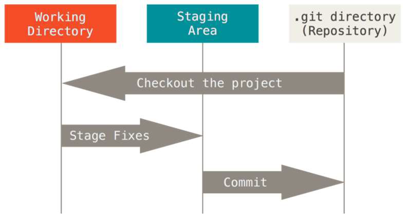

## Git

### 참고설명

> GUI - Graphic User Interface 
>
> CLI - Command Line Interface

### bash 명령어

> pwd : 현재 디렉토리 출력
>
> cd : 디렉토리 이동  . : 현재 디렉토리, .. : 상위 디렉토리
> ls : 목록
> mkdir : 디렉토리 생성
> touch : 파일의 날짜와 시간을 수정(0바이트 빈파일 생성)

### 기본 흐름

> 작업 - 스테이징 - 버전
>
> 

### Git 기본 명령어

1. $ git init : .git 폴더를 만들고 버전을 관리함

2. $ git add <filename\> : working directory상의 변경내용을 staging area에 추가

   ```bash
   $ git add a.txt b.txt # 복수의 디렉토리
   $ git add test_folder # 특정 폴더
   $ git add c.txt # 특정 파일
   $ git add "*.txt" # 특정 확장자
   ```

3. $ git commit -m 'message' : staged 상태의 파일들을 커밋을 통해 버전으로 기록해야 하며 변경 사항을 명확하게 작성해야 함

   - 스냅샷 방식으로 버전관리

4. $ git status : 파일의 상태를 알 수 있음

   - Untracked files
   - Changes not staged for commit
   - Changes to be commited

   ```bash
   $ git status
   
   On branch master
   
   # 커밋이 될 변경사항들
   # staging area에 있는.. staged 상태의 파일들..
   Changes to be committed:
     (use "git restore --staged <file>..." to unstage)
           deleted:    b.txt
           
   # staged(commit을 위한) 아닌 변경사항들
   # Working Directory에 있는.. 수정된 파일들 (기존에 커밋된 적 있는 파일)
   Changes not staged for commit:
     (use "git add <file>..." to update what will be committed)
     (use "git restore <file>..." to discard changes in working directory)
           modified:   a.txt
           
   # 트래킹 X 파일들
   # 커밋이 된적 없는 파일들..
   Untracked files:
     (use "git add <file>..." to include in what will be committed)
           b.docx
   ```

5. $ git log : 저장소에 기록된 커밋을 조회

   - $ git log -1 --oneline : 최근 1개만 한줄로

### git  실습  1

```bash
USER@DESKTOP-NF0PVQI MINGW64 ~/Desktop/test
$ git init
Initialized empty Git repository in C:/Users/USER/Desktop/test/.git/

USER@DESKTOP-NF0PVQI MINGW64 ~/Desktop/test (master)
$ git add a.txt

USER@DESKTOP-NF0PVQI MINGW64 ~/Desktop/test (master)
$ git commit -m "make a.txt"
[master (root-commit) 9cced7c] make a.txt
 1 file changed, 0 insertions(+), 0 deletions(-)
 create mode 100644 a.txt

USER@DESKTOP-NF0PVQI MINGW64 ~/Desktop/test (master)
$ git status
On branch master
nothing to commit, working tree clean

USER@DESKTOP-NF0PVQI MINGW64 ~/Desktop/test (master)
$ ls
a.txt  b.bmp

USER@DESKTOP-NF0PVQI MINGW64 ~/Desktop/test (master)
$ git status
On branch master
Untracked files:
  (use "git add <file>..." to include in what will be committed)
        b.bmp

nothing added to commit but untracked files present (use "git add" to track)

USER@DESKTOP-NF0PVQI MINGW64 ~/Desktop/test (master)
$ git add b.bmp

USER@DESKTOP-NF0PVQI MINGW64 ~/Desktop/test (master)
$ git commit -m "make b.bmp"
[master 6aedc8d] make b.bmp
 1 file changed, 0 insertions(+), 0 deletions(-)
 create mode 100644 b.bmp

USER@DESKTOP-NF0PVQI MINGW64 ~/Desktop/test (master)
$ git status
On branch master
Changes not staged for commit:
  (use "git add <file>..." to update what will be committed)
  (use "git restore <file>..." to discard changes in working directory)
        modified:   a.txt

no changes added to commit (use "git add" and/or "git commit -a")

USER@DESKTOP-NF0PVQI MINGW64 ~/Desktop/test (master)
$ git add a.txt

USER@DESKTOP-NF0PVQI MINGW64 ~/Desktop/test (master)
$ git commit -m "modify a.txt"
[master edbc062] modify a.txt
 1 file changed, 1 insertion(+)
```


### Git - 원격저장소

#### 원격저장소 조회

```bash
$ git remote -v # verbose 세부정보
```

#### 원격저장소 추가

```bash
$ git remote add origin <주소>
$ git remote add origin https://github.com/<username>/<저장소이름>.git
```

- 깃아, 원격 저장소(`remote`)를 추가해줘(`add`). `origin`이라는 이름으로, `주소`를
- 원격저장소가 이미 설정된 경우 설정이 되지 않는다. (remote origin already exists)

#### 원격저장소 삭제

```bash
$ git remote rm <원격저장소이름>
```

#### 원격저장소  push

```bash
$ git push <원격저장소이름> <브랜치이름>
$ git push origin master
$ git push -u origin main
Enumerating objects: 8, done.
Counting objects: 100% (8/8), done.
Delta compression using up to 8 threads
Compressing objects: 100% (5/5), done.
Writing objects: 100% (8/8), 674 bytes | 224.00 KiB/s, done.
Total 8 (delta 0), reused 0 (delta 0), pack-reused 0
To https://github.com/hozza94/test.git
 * [new branch]      main -> main
Branch 'main' set up to track remote branch 'main' from 'origin'.
```

- 깃아, `push`해줘 `origin`에 `master` 브랜치를
- `-u` option : upstream
  - `git push`라고 명령을 하더라도 설정된 원격저장소에 브랜치를 push
  - `git push -u origin master`

#### 원격저장소 clone

```bash
$ git clone <원격저장소주소>
```

- 원격저장소의 모든 이력을 가져오는 것.