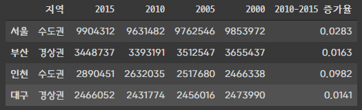
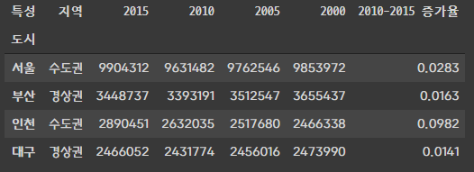

# DataFrame class - 1

`DataFrame`클래스는 **2차원 행렬 데이터**에 인덱스를 붙인 것과 비슷하다. `row index`, `column index` 를 붙일 수 있다.

---

## 생성

`pd.DataFrame(data, index, columns)`

```python
data = {
    "2015": [9904312, 3448737, 2890451, 2466052],
    "2010": [9631482, 3393191, 2632035, 2431774],
    "2005": [9762546, 3512547, 2517680, 2456016],
    "2000": [9853972, 3655437, 2466338, 2473990],
    "지역": ["수도권", "경상권", "수도권", "경상권"],
    "2010-2015 증가율": [0.0283, 0.0163, 0.0982, 0.0141]
}
columns = ["지역", "2015", "2010", "2005", "2000", "2010-2015 증가율"]
index = ["서울", "부산", "인천", "대구"]
df = pd.DataFrame(data, index=index, columns=columns)
df
```




## 접근

```python
df.지역.values # array(['수도권', '경상권', '수도권', '경상권'], dtype=object)
df.columns # Index(['지역', '2015', '2010', '2005', '2000', '2010-2015 증가율'], dtype='object')
```


## 행, 열 이름

```python
df.index.name = '도시'
df.columns.name = '특성'
df
```




## Column data

### Update

```python
df['2010-2015 증가율'] *= 100
```

### Add

- [] 안에 새로 추가하고 싶은 `column`의 이름을 넣는다.

```python
df['2020'] = [1, 2, 3, 4]
```

### Delete

```python
del df['2020']
```


## Column Indexing

```python
# df['서울']은 오류 발생
df[:'서울']
df[1:2]
df['부산':'인천']

df.head(3) # 앞에서 부터 3개만 보여줌
df.tail(2) # 뒤에서 부터 2개만 보여줌
```


### 개별 데이터  인덱싱

```python
# df['열이름']['행이름']
# 서울의 2015년 데이터
df['2015']['서울'], df['2015'].서울, df['2015'][0]
```


### 고급 데이터 인덱싱

- DataFrame은 기본 열, 행 순서이다
- `df.loc[행, 열]`로 접근 가능
- `df.iloc[n, n]`로 접근 가능


#### Ioc Indexer

`df.loc['x']` 행 인덱싱

`df.loc['x', 'A']` 행 열 인덱싱

`df.loc['df,A>10, 'A']` 슬라이싱 및 조건도 사용 가능


#### iloc Indexer

`df.iloc[0,0]` `df.iloc[:2, 1:]` loc 명령어와 동일하게 사용 가능

